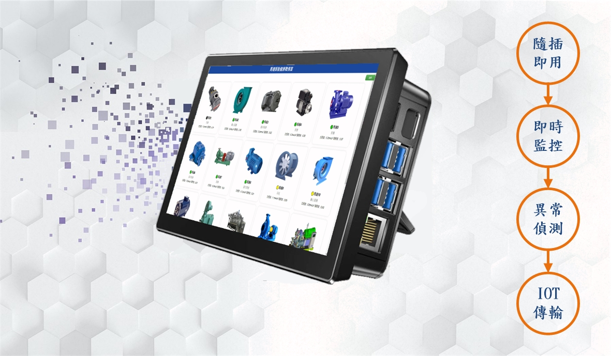
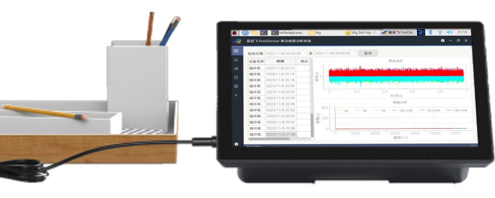

# 設備監測運算平台FastSensor
具備資料擷取、分析運算、資料上傳等多合一功能的優點，適用於 Linux、Windows、ARM多平台。提供在高精度、高取樣速率的狀態下，針對旋轉機械與設備，進行長時間的機械狀態監測，協助各種馬達、工具機等中小型工廠及機械設備的使用者順利解決傳統設備維護所面臨的各種挑戰，用最輕鬆無負擔的方式將機械設備智慧化。

> **加入 Facebook 社團**
>
> [https://www.facebook.com/groups/isoface/](https://www.facebook.com/groups/isoface/)
> 
> **點讚追蹤 Facebook 粉絲專頁**
> 
> [https://www.facebook.com/AIOT.ERP](https://www.facebook.com/AIOT.ERP)

FastSensor具備資料擷取、分析運算、資料上傳等多合一功能的優點，提供在高精度、高取樣速率的狀態下，針對旋轉機械與設備，進行長時間的機械狀態監測，協助各種馬達、工具機等中小型工廠及機械設備的使用者順利解決傳統設備維護所面臨的各種挑戰，用最輕鬆無負擔的方式將機械設備智慧化。

由於即時處理數據的能力與更快的反應時間，邊緣運算在工業物聯網(IIoT)，具有很高的應用性。FastSensor也因應雲端架構，會出現的過度負載、延遲、即時回應等問題，據此採用分散式運算架構，資料在數據採集地處理，不用上傳到雲端、在本地端處理和分析，進而減輕網絡和服務器的負載。以更接近終端設備的方式，取代部分雲端功能(例如︰儲存、傳輸、分析、回應等)。

## 特色

* 突破距離限制進行分散及遠端之資料擷取，再將資料轉化為資訊，作為邊緣分析之用。不但有豐富的連結性，更易於將資料傳輸至後台伺服器或SCADA監控系統。整合 [數控中心―設備故障診斷系統](https://github.com/isoface-iot/light_signal)，紀錄設備運行狀況，並隨時上傳至 FastWeb物聯網系平台。

* 簡易、可擴充、可持續使用之邊緣裝置，為工廠自動化、工業物聯網、和傳統測試和量測應用提供完整的解決方案。整合 [數控中心―燈號管理系統](https://github.com/isoface-iot/light_signal)，在設備或生產供現場加裝三色燈等即時觀看排除設備問題。

* 將採集數據，經由類神經網路建立智能模型，以AI人工智慧提供分佈式運算解決方案，迅速判斷機械設備健康狀態。

* 提供有線乙太網路(RJ45)、無線網路(WiFi)接口，利用網際網路連接ERP資產設備管理系統，遠地查詢設備故障與維修單據，進行即時處理。減少額外的網路設備並可延伸使用距離，有效降低使用成本並提高設備投資收益。

* 使用高速三軸加速規(採樣頻率26.7Khz)即時測量安裝點的溫度與三個方向振動頻率，應用於工業領域的電機、水泵、風機、空壓機、燃氣機、發電機、減速機、齒輪箱等旋轉機械的工作狀態分析，得出設備準確的運行狀態和設備健康情況。

* 使用Modbus RTU通訊協定，連接各式感測器採集機械設備檢測數據(例如︰電壓、電流、轉速…)

